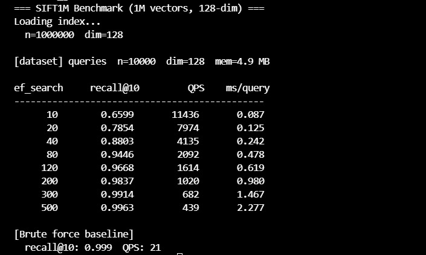
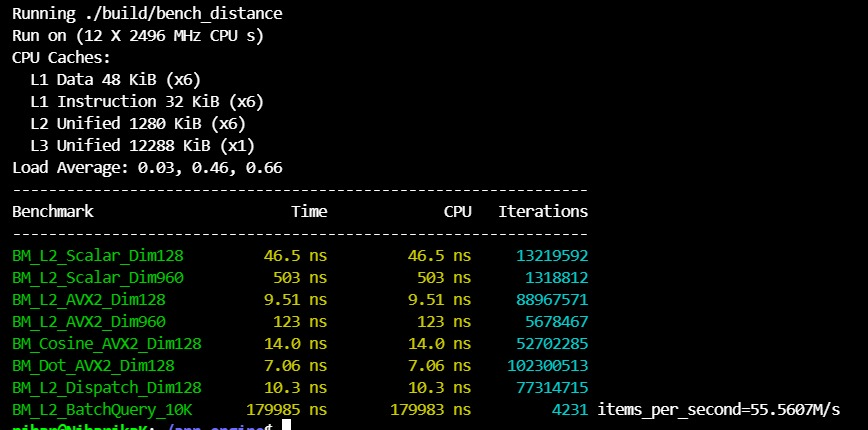
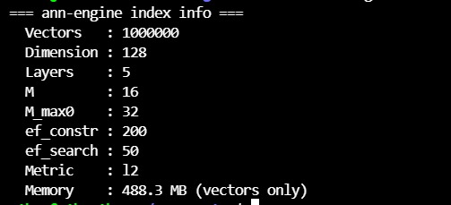

# ann-engine

> A high-performance approximate nearest neighbor (ANN) search engine implemented from scratch in **C++17**, featuring the HNSW graph algorithm with **AVX2 SIMD-optimized distance kernels**.

Built to understand how production vector search engines (Pinecone, Weaviate, Faiss) work under the hood. Implements the original [Malkov & Yashunin 2018](https://arxiv.org/abs/1603.09320) paper end-to-end.

---

## Benchmark Results — SIFT1M (1M × 128-dim float vectors)



| ef\_search | recall@10 | QPS    | ms/query |
|-----------|-----------|--------|----------|
| 10        | 65.99%    | 11,436 | 0.087    |
| 20        | 78.54%    | 7,974  | 0.125    |
| 40        | 88.03%    | 4,135  | 0.242    |
| 80        | 94.46%    | 2,092  | 0.478    |
| 120       | 96.68%    | 1,614  | 0.619    |
| 200       | **98.37%**| 1,020  | 0.980    |
| 300       | 99.14%    | 682    | 1.467    |
| 500       | **99.63%**| 439    | 2.277    |
| Brute force | 99.9%  | 21     | —        |

**At ef=80: 94.5% recall at 2,092 QPS — 100× faster than brute-force exact search.**
**At ef=200: 98.4% recall at 1,020 QPS — 49× faster than brute-force.**

---

## Distance Kernel Benchmarks — AVX2 vs Scalar



| Benchmark             | Scalar  | AVX2    | Speedup  |
|----------------------|---------|---------|----------|
| L2 distance, dim=128  | 46.5 ns | 9.51 ns | **4.9×** |
| L2 distance, dim=960  | 503 ns  | 123 ns  | **4.1×** |
| Cosine, dim=128       | —       | 14.0 ns | —        |
| Dot product, dim=128  | —       | 7.06 ns | —        |
| Batch query (10K db)  | —       | 180 µs  | 55M dist/sec |

AVX2 processes 8 floats per CPU instruction using 256-bit SIMD registers (`_mm256_fmadd_ps`), giving a consistent **~5× speedup** over scalar on the hottest inner loop.

---

## Index Info — SIFT1M



```
Vectors   : 1,000,000
Dimension : 128
Layers    : 5
M         : 16   (max neighbors per node)
M_max0    : 32   (max neighbors at layer 0)
ef_constr : 200  (beam width during build)
Metric    : L2
Memory    : 488.3 MB (vectors only)
```

---

## Test Suite — 45/45 Passing


45 unit tests across 18 test suites covering distance correctness, HNSW insert/search, recall vs brute-force, save/load round-trip, and IO format parsing.

---

## Architecture

### How HNSW Works

HNSW builds a multi-layer graph where upper layers are sparse long-range connections for fast global navigation, and layer 0 is dense with short-range connections for precise local search.

```
Layer 3:  o ————————————————— o          (sparse, long jumps)
Layer 2:  o ———— o ———————— o            
Layer 1:  o — o — o — o — o — o          
Layer 0:  o-o-o-o-o-o-o-o-o-o-o-o-o     (dense, short-range)
```

Query: greedy descent layer-by-layer → beam search at layer 0 → return top-k.
Time complexity: **O(log N)** vs brute-force **O(N × dim)**

### Project Structure

```
ann-engine/
├── include/
│   ├── hnsw.h        ← index class, HNSWConfig, RecallResult
│   ├── distance.h    ← scalar + AVX2 L2/cosine/dot declarations
│   └── io.h          ← .fvecs / .bvecs / .ivecs dataset loaders
├── src/
│   ├── hnsw.cpp      ← INSERT, SEARCH, SELECT-NEIGHBORS (Algorithm 1,2,4)
│   ├── distance.cpp  ← AVX2 SIMD kernels with tail-loop handling
│   ├── io.cpp        ← binary dataset I/O
│   └── main.cpp      ← CLI: build / query / bench / info subcommands
├── tests/            ← 45 Google Test unit tests
├── bench/            ← Google Benchmark microbenchmarks
└── CMakeLists.txt    ← FetchContent: GoogleTest, Benchmark, CLI11
```

### Key Design Decisions

**1. Flat `float[]` vector storage**
All vectors in one contiguous allocation (`std::vector<float> vecs_`) instead of per-node pointers. Eliminates pointer chasing during distance computation — the hottest path in the system.

**2. Generation-based visited tracking**
O(1) mark/check using a flat `uint32_t[]` array with a generation counter instead of `std::unordered_set<int>`. Avoids hash table allocation/lookup overhead inside the inner search loop.

**3. Heuristic neighbor selection (Algorithm 4)**
Prefers *diverse* neighbors over simply the M closest ones. A candidate is kept only if it is closer to the query than to any already-selected neighbor. This improves long-range graph connectivity and recall at low ef values.

**4. AVX2 SIMD distance kernels**
Hand-written using Intel intrinsics (`_mm256_fmadd_ps`, `_mm256_loadu_ps`). Processes 8 floats per instruction with a scalar tail loop for non-multiples of 8. Auto-detected at CMake configure time; falls back to scalar if unavailable.

---

## Build

**Requirements:** GCC 11+ or Clang 13+, CMake 3.20+.
Dependencies (GoogleTest, Google Benchmark, CLI11) are fetched automatically.

```bash
git clone https://github.com/niharikakanithi9-lab/ann-engine
cd ann-engine
cmake -B build -DCMAKE_BUILD_TYPE=Release
cmake --build build -j$(nproc)
```

---

## Usage

### Build an index
```bash
./build/ann-engine build \
    --data data/sift/sift_base.fvecs \
    --out  index.bin \
    --M 16 --ef-construction 200
```

### Run queries
```bash
./build/ann-engine query \
    --index index.bin \
    --query data/sift/sift_query.fvecs \
    --k 10 --ef 50
```

### Benchmark recall vs QPS (sweep ef_search)
```bash
./build/ann-engine bench \
    --index index.bin \
    --query data/sift/sift_query.fvecs \
    --gt    data/sift/sift_groundtruth.ivecs
```

### Print index metadata
```bash
./build/ann-engine info --index index.bin
```

### Run tests
```bash
./build/tests --gtest_color=yes
```

### Run microbenchmarks
```bash
./build/bench_distance   # scalar vs AVX2 speedup
./build/bench_query      # query latency at different ef values
```

---

## Dataset

Uses the [SIFT1M benchmark](http://corpus-texmex.irisa.fr/) — 1M 128-dimensional SIFT image descriptors. The same dataset used in ANN research papers from Google, Meta, and Microsoft.

```bash
mkdir -p data && cd data
wget ftp://ftp.irisa.fr/local/texmex/corpus/sift.tar.gz
tar -xzf sift.tar.gz
```

---

## References

- Malkov, Y., Yashunin, D. (2018). *Efficient and robust approximate nearest neighbor search using Hierarchical Navigable Small World graphs.* [arXiv:1603.09320](https://arxiv.org/abs/1603.09320)
- [ann-benchmarks.com](https://ann-benchmarks.com) — standard ANN recall vs QPS evaluation
